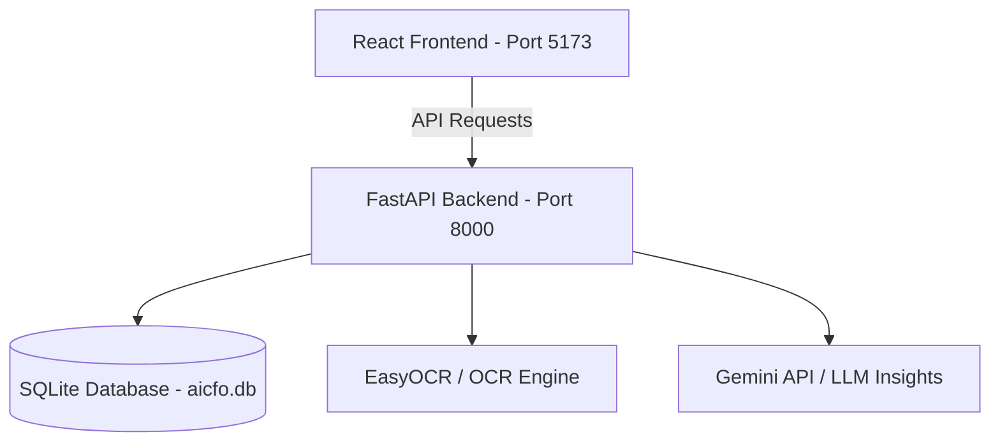

# AI CFO - Smart Financial Assistant

AI CFO is an advanced, AI-powered financial management and assistant platform designed to automate invoice processing, transaction classification, forecasting, fraud detection, and tax estimation. It features a modern React-based frontend and a robust FastAPI-based backend.

---

## 🚀 Getting Started

### Prerequisites
- Python 3.10+
- Node.js 18+
- npm (Node Package Manager)

---

## 🛠️ Installation & Setup

### 1. Backend Setup (FastAPI)

1. Open a terminal and navigate to the `backend` directory:
   ```bash
   cd backend
   ```

2. Create a virtual environment and activate it:
   - **Windows (PowerShell):**
     ```powershell
     python -m venv venv
     .\venv\Scripts\Activate.ps1
     ```
   - **macOS/Linux:**
     ```bash
     python3 -m venv venv
     source venv/bin/activate
     ```

3. Install the required Python dependencies:
   ```bash
   pip install -r requirements.txt
   ```

4. Create/verify the `.env` file in the `backend` directory:
   ```env
   SECRET_KEY=your-jwt-secret-key-here
   GEMINI_API_KEY=your-gemini-api-key
   ```

5. Start the backend development server:
   ```bash
   python -m uvicorn app:app --reload --port 8000
   ```
   *The backend API will run on `http://127.0.0.1:8000`.*

### 2. Frontend Setup (React + Vite)

1. Open a new terminal and navigate to the `frontend` directory:
   ```bash
   cd frontend
   ```

2. Install the frontend dependencies:
   ```bash
   npm install
   ```

3. Start the Vite development server:
   ```bash
   npm run dev
   ```
   *The frontend dashboard will run on `http://localhost:5173/`.*

---

## 🔑 Authentication & Password Rules

To create a new account, go to the registration page (`http://localhost:5173/register`).

### Password Security Requirements:
*   Minimum of **8 characters**
*   Must contain at least **1 digit** (e.g., `0-9`)
*   *Example of a valid password:* `Prashant@11`

> [!NOTE]
> If registration fails with the message **"Cannot connect to the server..."**, ensure that the FastAPI backend server is actively running on port `8000`. If the backend is offline, the frontend will be unable to process registration requests.

---

## 📦 Project Architecture & Key Components



### Backend Structure (`/backend`)
*   [app.py](file:///c:/Users/admin/Desktop/ai%20cfo/backend/app.py): Entry point for the FastAPI server. Registers all sub-routers, initializes Database tables, and configures CORS.
*   [auth/](file:///c:/Users/admin/Desktop/ai%20cfo/backend/auth): Handles JWT authentication, password hashing (`bcrypt`), verification, and dependencies.
*   [models/](file:///c:/Users/admin/Desktop/ai%20cfo/backend/models): SQLAlchemy database tables (`User`, `Transaction`, `Invoice`).
*   [routers/](file:///c:/Users/admin/Desktop/ai%20cfo/backend/routers): Modular endpoints including:
    *   `/auth`: User registration, login, profile management.
    *   `/transactions`: Ledger records, categorizer integration.
    *   `/invoice`: OCR processing, parsing, duplicate checking.
    *   `/fraud`: Anomaly detection, vendor mismatch detection.
    *   `/insights` & `/forecast`: Cash flow forecasts and AI-generated analysis.
*   [tests/](file:///c:/Users/admin/Desktop/ai%20cfo/backend/tests): Complete suite of API integration and boundary isolation tests.

### Frontend Structure (`/frontend`)
*   [src/pages/](file:///c:/Users/admin/Desktop/ai%20cfo/frontend/src/pages): Interactive views for Dashboard, AI Chat, Invoices, Transactions, Fraud, Forecasts, and Profile.
*   [src/context/](file:///c:/Users/admin/Desktop/ai%20cfo/frontend/src/context): Context providers managing state for authentication and feedback notifications.
*   [src/services/api.js](file:///c:/Users/admin/Desktop/ai%20cfo/frontend/src/services/api.js): Axios instance pre-configured with headers and response interceptors.

---

## 🧪 Running Integration Tests

To run the verification test suite on the backend, ensure your backend server is running and execute:
```bash
cd backend
python tests/verify_auth.py
python tests/verify_all.py
```
